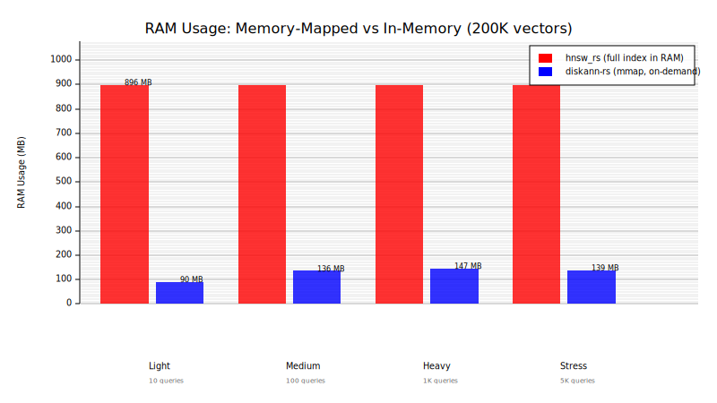
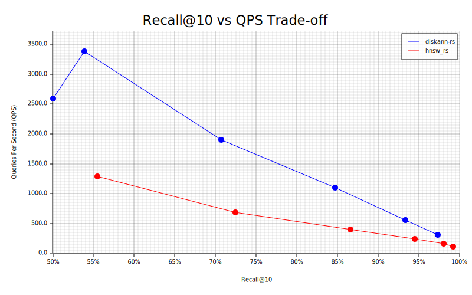
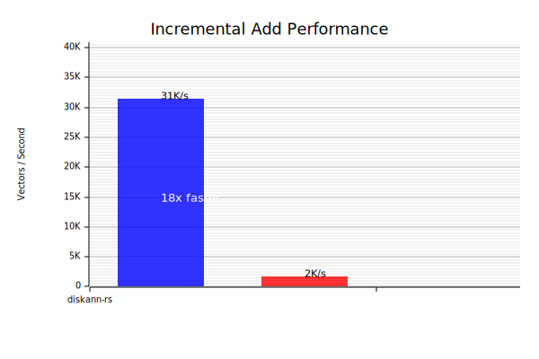

# DiskANN Implementation in Rust

[](https://crates.io/crates/diskann_rs)
[](https://docs.rs/diskann_rs/latest/diskann_rs/)

A Rust implementation of [DiskANN](https://proceedings.neurips.cc/paper_files/paper/2019/hash/09853c7fb1d3f8ee67a61b6bf4a7f8e6-Abstract.html) (Disk-based Approximate Nearest Neighbor search) using the Vamana graph algorithm. This project provides an efficient and scalable solution for large-scale vector similarity search with minimal memory footprint.

## When to Use diskann-rs

| Use diskann-rs when... | Use in-memory indexes (hnsw_rs) when... |
|------------------------|----------------------------------------|
| Index is larger than available RAM | Index fits comfortably in RAM |
| You need incremental updates without rebuilding | Build time is critical (one-time cost) |
| Memory-constrained environments (containers, edge) | Maximum recall needed (98%+) |
| Multiple large indexes on same machine | Single index, dedicated resources |
| Cost-sensitive deployments | Latency-critical applications |

**TL;DR**: diskann-rs trades ~60% slower build time for 6-10x lower memory usage and 15x faster incremental updates.

## Key Features

| Feature | Description |
|---------|-------------|
| **Incremental Updates** | Add/delete vectors without rebuilding the entire index |
| **Filtered Search** | Query with metadata predicates (e.g., category filters) |
| **SIMD Acceleration** | Optimized distance calculations (AVX2, SSE4.1, NEON) |
| **Product Quantization** | Compress vectors up to 64x with PQ encoding |
| **Memory-Mapped I/O** | Single-file storage with minimal RAM footprint |
| **Parallel Processing** | Concurrent index building and batch queries |

## Quick Start

### Basic Index Operations

```rust
use anndists::dist::DistL2;
use diskann_rs::{DiskANN, DiskAnnParams};

// Build index
let vectors: Vec<Vec<f32>> = vec![vec![0.1, 0.2, 0.3], vec![0.4, 0.5, 0.6]];
let index = DiskANN::<DistL2>::build_index_default(&vectors, DistL2 {}, "index.db")?;

// Search
let query = vec![0.1, 0.2, 0.4];
let neighbors: Vec<u32> = index.search(&query, 10, 256);
```

### Incremental Updates (No Rebuild Required)

```rust
use anndists::dist::DistL2;
use diskann_rs::IncrementalDiskANN;

// Build initial index
let vectors = vec![vec![0.0; 128]; 1000];
let index = IncrementalDiskANN::<DistL2>::build_default(&vectors, "index.db")?;

// Add new vectors without rebuilding
let new_vectors = vec![vec![1.0; 128]; 100];
index.add_vectors(&new_vectors)?;

// Delete vectors (instant tombstoning)
index.delete_vectors(&[0, 1, 2])?;

// Compact when needed (merges delta layer)
if index.should_compact() {
    index.compact("index_v2.db")?;
}
```

### Filtered Search (Metadata Predicates)

```rust
use anndists::dist::DistL2;
use diskann_rs::{FilteredDiskANN, Filter};

// Build with labels (e.g., category IDs)
let vectors = vec![vec![0.0; 128]; 1000];
let labels: Vec<Vec<u64>> = (0..1000).map(|i| vec![i % 10]).collect(); // 10 categories

let index = FilteredDiskANN::<DistL2>::build(&vectors, &labels, "filtered.db")?;

// Search only category 5
let filter = Filter::label_eq(0, 5);
let results = index.search_filtered(&query, 10, 128, &filter);

// Complex filters
let filter = Filter::and(vec![
    Filter::label_eq(0, 5),           // category == 5
    Filter::label_range(1, 10, 100),  // price in [10, 100]
]);
```

### Product Quantization (64x Compression)

```rust
use diskann_rs::pq::{ProductQuantizer, PQConfig};

// Train quantizer
let config = PQConfig {
    num_subspaces: 8,      // M = 8 segments
    num_centroids: 256,    // K = 256 codes per segment
    ..Default::default()
};
let pq = ProductQuantizer::train(&vectors, config)?;

// Encode vectors (128-dim f32 -> 8 bytes)
let codes: Vec<Vec<u8>> = pq.encode_batch(&vectors);

// Fast approximate distance using lookup table
let table = pq.create_distance_table(&query);
let dist = pq.distance_with_table(&table, &codes[0]);
```

### SIMD-Accelerated Distance

```rust
use diskann_rs::{SimdL2, DiskANN, simd_info};

// Check available SIMD features
println!("{}", simd_info()); // "SIMD: NEON" or "SIMD: AVX2, SSE4.1"

// Use SIMD-optimized L2 distance
let index = DiskANN::<SimdL2>::build_index_default(&vectors, SimdL2, "index.db")?;

// Or use SIMD directly
use diskann_rs::simd::{l2_squared, dot_product, cosine_distance};
let dist = l2_squared(&vec_a, &vec_b);
```

## Performance

### Why diskann-rs? Memory-Mapped I/O

Unlike in-memory indexes that require loading the entire graph into RAM, diskann-rs uses memory-mapped files. The OS loads only the pages you access, making it ideal for large-scale deployments:

<p align="center">
  
</p>

| Workload | diskann-rs | hnsw_rs | Savings |
|----------|------------|---------|---------|
| Light (10 queries) | 90 MB | 896 MB | **10x less RAM** |
| Medium (100 queries) | 136 MB | 896 MB | **6.6x less RAM** |
| Heavy (1K queries) | 147 MB | 896 MB | **6x less RAM** |
| Stress (5K queries) | 139 MB | 896 MB | **6.4x less RAM** |

*Tested with 200K vectors, 128 dimensions. hnsw_rs must hold the full index in RAM; diskann-rs loads pages on-demand.*

### Benchmark Comparisons (vs hnsw_rs)

<table>
<tr>
<td width="50%">

</td>
<td width="50%">

</td>
</tr>
</table>

| Metric | diskann-rs | hnsw_rs | Winner |
|--------|------------|---------|--------|
| **QPS at 93% recall** | 586 | 170 | diskann-rs (3.4x) |
| **Add vectors** | 31,000 vec/s | 2,000 vec/s | diskann-rs (15x) |
| **Delete vectors** | Instant (tombstone) | Full rebuild | diskann-rs |
| **Build time** | 33s / 100K | 21s / 100K | hnsw_rs (1.6x) |
| **Max recall** | 97.5% | 99.2% | hnsw_rs |

### Dataset Benchmarks

Benchmarks on Apple M4 Max:

| Dataset | Vectors | Build Time | QPS | Recall@10 |
|---------|---------|------------|-----|-----------|
| SIFT-1M | 1,000,000 | 295s | 8,590 | 99.6% |
| Fashion-MNIST | 60,000 | 111s | 18,000 | 98.8% |
| Random-50K | 50,000 | 38s | 2,200 | 85.6% |

### Memory Efficiency

- ~330MB RAM for 2GB index (16% of file size)
- Product Quantization: 64x compression (512 bytes → 8 bytes per vector)

## Architecture

### File Layout

```
[ metadata_len:u64 ][ metadata (bincode) ][ padding to 1 MiB ]
[ vectors (n × dim × f32) ][ adjacency (n × max_degree × u32) ]
```

### Incremental Updates (Delta Layer)

```
┌─────────────────────────────────────────────────────────────┐
│                  IncrementalDiskANN                         │
├─────────────────────────────────────────────────────────────┤
│  ┌──────────────────┐  ┌──────────────────┐  ┌───────────┐  │
│  │   Base Index     │  │   Delta Layer    │  │ Tombstones│  │
│  │   (mmap file)    │  │   (in-memory)    │  │  (BitSet) │  │
│  │                  │  │   + mini-graph   │  │           │  │
│  └──────────────────┘  └──────────────────┘  └───────────┘  │
└─────────────────────────────────────────────────────────────┘

Search: query base → merge delta → filter tombstones → return
```

## Parameters

### Build Parameters

| Parameter | Default | Description |
|-----------|---------|-------------|
| `max_degree` | 64 | Maximum neighbors per node (32-64) |
| `build_beam_width` | 128 | Construction beam width (128-256) |
| `alpha` | 1.2 | Pruning diversity factor (1.2-2.0) |

### Search Parameters

| Parameter | Typical | Trade-off |
|-----------|---------|-----------|
| `beam_width` | 128-512 | Higher = better recall, slower |
| `k` | 10-100 | Number of neighbors to return |

## Building and Testing

```bash
# Build
cargo build --release

# Run tests
cargo test --lib

# Run benchmarks
cargo bench --bench benchmark

# Large benchmarks (slower)
DISKANN_BENCH_LARGE=1 cargo bench --bench benchmark
```

## Comparison with rust-diskann

| Feature | diskann-rs | rust-diskann |
|---------|------------|--------------|
| Incremental updates | Yes | No |
| Filtered search | Yes | No |
| Product Quantization | Yes | No |
| SIMD acceleration | Yes | Uses anndists |
| Generic vector types | f32 | f32, u64, etc. |

## License

MIT License - see [LICENSE](LICENSE) for details.

## References

- [DiskANN Paper (NeurIPS 2019)](https://proceedings.neurips.cc/paper_files/paper/2019/hash/09853c7fb1d3f8ee67a61b6bf4a7f8e6-Abstract.html)
- [Microsoft DiskANN Repository](https://github.com/Microsoft/DiskANN)
